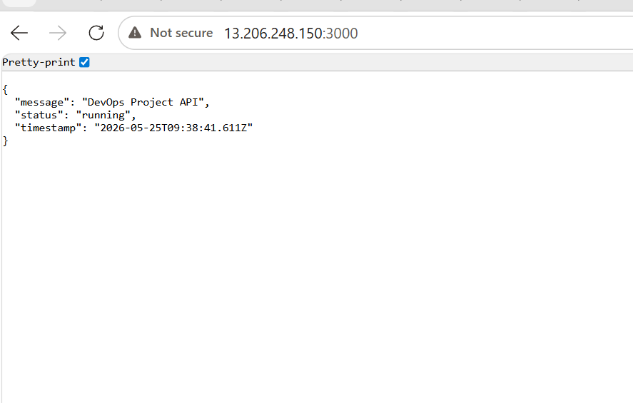
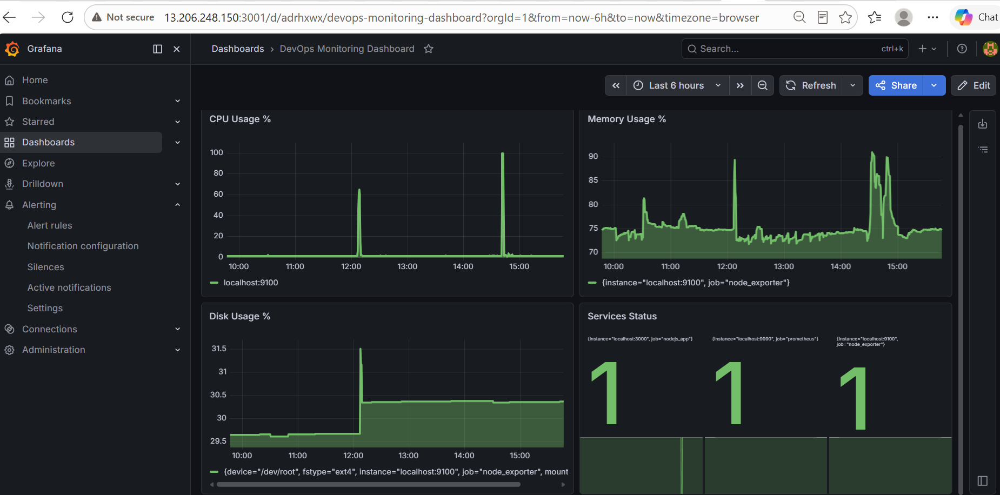
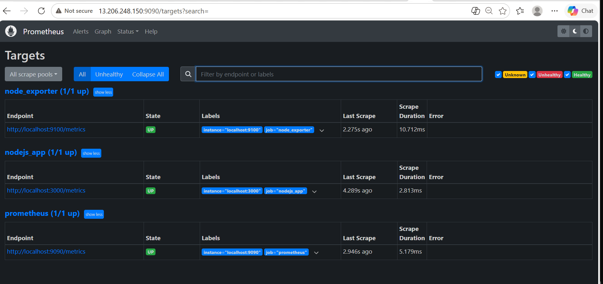
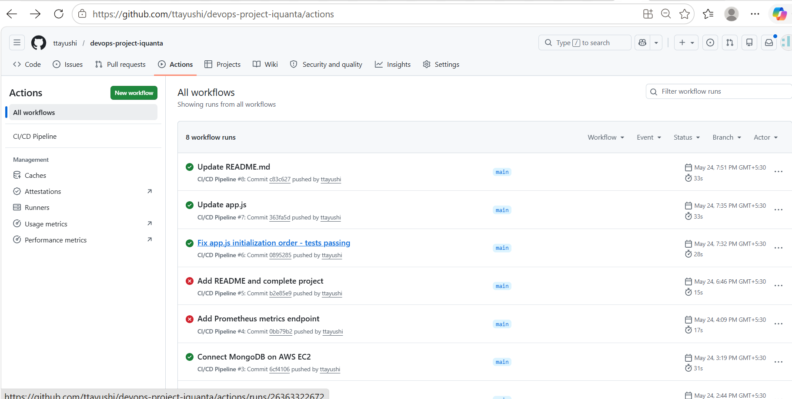
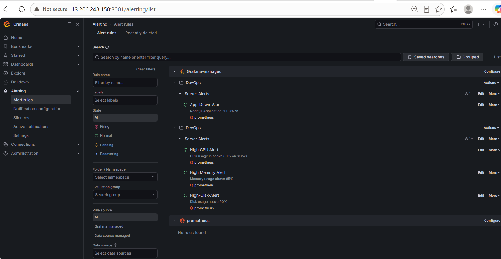

# DevOps Project — Ayushi Tiwari

A complete DevOps project demonstrating CI/CD, containerization, monitoring, and cloud deployment using AWS.

## Live URLs
- Application: http://13.206.248.150:3000
- Prometheus: http://13.206.248.150:9090
- Grafana: http://13.206.248.150:3001

## Architecture
Client → Node.js API → MongoDB  
            ↓  
        Docker Container  
            ↓  
         AWS EC2  
            ↓  
   Prometheus → Grafana → Alerts

## Features Implemented
✅ Node.js Application with REST APIs
✅ Dockerized Application
✅ CI/CD Pipeline — GitHub Actions
✅ MongoDB deployed on AWS EC2
✅ Automated Backup — Daily cron job
✅ Prometheus Monitoring — All targets UP
✅ Grafana Dashboards — CPU, Memory, Disk
✅ Email Alerting — Configured and tested

## Tech Stack
- Node.js, Express.js
- MongoDB
- Docker
- GitHub Actions
- AWS EC2
- Prometheus
- Grafana

## CI/CD Pipeline
Push to main → Tests run → Docker build → Deploy

## Monitoring
- CPU Usage Dashboard
- Memory Usage Dashboard  
- Disk Usage Dashboard
- Email alerts on threshold breach

## Setup Instructions
1. Clone repo
2. npm install
3. Configure .env
4. docker-compose up --build

## Screenshots

### Application Running

### Grafana Dashboard

### Prometheus Targets

### CI/CD Pipeline

### Alert Rules

### CPU Alert

### Memory Alert

### Disk Alert

### App Down Alert

